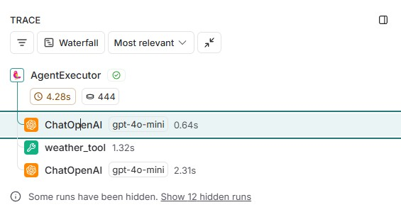
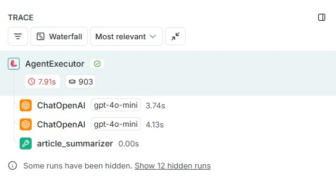

# Agent Tools 創建與追蹤

## 項目概述
本項目專注於開發和展示工具調用（Tools Calling）功能，並使用LangSmith進行監控和分析。LangSmith提供以下功能：
- **調用流程可視化**: 清晰展示工具調用流程
- **性能監控**: 追蹤工具執行效率
- **錯誤診斷**: 快速定位和解決問題

## 項目簡介
本項目提供兩個實用的工具：
1. 天氣查詢工具 - 查詢臺灣各縣市的天氣資訊
2. 文章摘要工具 - 自動生成文章摘要，可選關鍵字分析

## 工具列表

### 1. 天氣查詢工具 (weather_tool)
- **功能**: 查詢臺灣縣市的天氣資料
- **輸入格式**: 
  - `city`: 臺灣縣市名稱（需繁體中文，如'臺北市'）
- **特點**:
  - 自動將「台」轉換為「臺」
  - 自動補上「市」或「縣」

- **weather_tool 創建示例**:
```python
# 函數式寫法(StructuredTool.from_function)：由 LangChain 内部自動生成 args_schema

# 定義天氣查詢工具的輸入格式
def get_weather(city: str = Field(description="臺灣縣市名稱（需繁體中文，如'臺北市'），系統會自動將「台」轉換為「臺」並補上「市」或「縣」")) -> str:
    """根據輸入的城市名稱查詢天氣資料"""
    # 使用自行創建的 Google Apps Script 的 API 來獲取天氣資料
    response = requests.get(
        'https://script.google.com/macros/s/AKfycbwK-D0X0tB_P5KjEU-Wi9R1Oc5ZwIUUM41b9zZnt-Qti-IujrAtKe4RivAPPBhpZfkR2A/exec',
        params={'cityName': city}
    )
    if response.status_code == 200:
        try:
            return response.json()
        except requests.JSONDecodeError:
            return {"error": "回應不是有效的 JSON 格式"}
    else:
        return {"error": f"請求失敗，狀態碼: {response.status_code}"}
    
# 創建天氣查詢工具
weather_tool = StructuredTool.from_function(
    func = get_weather,
    name = "weather_tool",
    description = "根據輸入的臺灣縣市查詢天氣資料",
)
```


### 2. 文章摘要工具 (ArticleSummarizerTool)
- **功能**: 生成文章摘要，可選關鍵字分析
- **輸入格式**:
  - `text`: 要摘要的文章內容
  - `max_length`: 摘要的最大字數（默認100）
  - `keywords`: 是否包含關鍵字分析（默認False）

- **ArticleSummarizerTool 創建示例**:
```python
# 類別式寫法（BaseTool + BaseModel）:透過 BaseModel 統一管理參數規則

# 定義文章摘要工具的輸入格式
class ArticleInput(BaseModel):
    """文章摘要工具的輸入格式"""
    text: str = Field(description="要進行摘要的文章內容")
    max_length: int = Field(description="摘要的最大字數", default=100)
    keywords: bool = Field(description="是否包含關鍵字分析", default=False)

# 定義文章摘要工具
class ArticleSummarizerTool(BaseTool):
    """文章摘要工具"""
    name: str = "article_summarizer"
    description: str = "生成文章摘要，可選擇是否包含關鍵字分析"
    args_schema: Type[BaseModel] = ArticleInput
    
    def _extract_keywords(self, text: str) -> list:
        """提取關鍵字"""
        # 這裡使用簡單的實現，實際應用中可以使用更複雜的算法
        words = re.findall(r'\w+', text.lower())
        word_freq = {}
        for word in words:
            if len(word) > 3:  # 只考慮長度大於3的詞
                word_freq[word] = word_freq.get(word, 0) + 1
        return sorted(word_freq.items(), key=lambda x: x[1], reverse=True)[:5]
    
    def _create_summary(self, text: str, max_length: int) -> str:
        """生成摘要"""
        # 簡單實現，實際應用中可以使用更複雜的算法
        sentences = text.split('。')
        summary = '。'.join(sentences[:3])  # 取前三句
        if len(summary) > max_length:
            summary = summary[:max_length] + '...'
        return summary
    
    def _run(self, text: str, max_length: int = 100, keywords: bool = False) -> str:
        """執行摘要生成"""
        try:
            summary = self._create_summary(text, max_length)
            if keywords:
                top_keywords = self._extract_keywords(text)
                keywords_str = ', '.join([f"{word}({freq}次)" for word, freq in top_keywords])
                return f"摘要：{summary}\n\n關鍵字：{keywords_str}"
            return f"摘要：{summary}"
        except Exception as e:
            return f"摘要生成錯誤: {str(e)}"
    
    async def _arun(self, text: str, max_length: int = 100, keywords: bool = False) -> str:
        """非同步執行"""
        return self._run(text, max_length, keywords)
```


## 工具選擇邏輯

工具調用邏輯由LangChain的AgentExecutor處理，它會根據以下流程選擇合適的工具：

1. **解析用戶輸入**
2. **匹配工具描述**:
   - 比較用戶輸入與每個工具的`description`
   - 計算語義相似度
   - 選擇最匹配的工具
3. **輸入驗證**
4. **執行工具**
5. **返回結果**

### 1. 天氣查詢工具 (weather_tool)


### 2. 文章摘要工具 (ArticleSummarizerTool)


## LangChain 工具創建方式與Pydantic整合

### Pydantic Field 介紹
- **作用**: 定義模型字段的元數據和驗證規則
- **常用參數**:
  - `description`: 字段的描述信息
  - `default`: 字段的默認值
  - `alias`: 字段的別名
  - `min_length`/`max_length`: 字符串長度限制
  - `gt`/`lt`: 數值範圍限制
  - `regex`: 正則表達式驗證
- **示例**:
```python
from pydantic import BaseModel, Field

class ExampleModel(BaseModel):
    name: str = Field(description="用戶姓名", min_length=2, max_length=50)
    age: int = Field(description="用戶年齡", gt=0, lt=120)
```

## 總結

LangChain 提供了多種創建工具的方式均與Pydantic深度整合：

### 1. 函數式寫法 (StructuredTool.from_function)
- **特點**: 
  - 由 LangChain 内部自動生成 args_schema
  - 基於Pydantic的類型提示自動驗證輸入
- **優點**: 
  - 簡單快速，適合簡單的工具
  - 自動處理輸入驗證
- **示例**: 天氣查詢工具採用此方式
- **Pydantic角色**:
  - 自動從函數簽名生成輸入schema
  - 驗證輸入參數的類型和格式

### 2. 類別式寫法 (BaseTool + BaseModel)
- **特點**: 
  - 透過繼承BaseModel定義參數規則
  - 完全控制輸入驗證邏輯
- **優點**: 
  - 更靈活，適合複雜的工具
  - 可自定義驗證規則
- **示例**: 文章摘要工具採用此方式
- **Pydantic角色**:
  - 定義嚴格的輸入schema
  - 提供豐富的驗證功能
  - 支持嵌套數據結構

## 工具調用邏輯

1. **輸入驗證**:
   - 使用Pydantic schema驗證輸入參數
   - 自動轉換數據類型
   - 提供清晰的錯誤信息

2. **執行流程**:
   - 調用工具的`_run`方法
   - 處理業務邏輯
   - 返回結果

3. **錯誤處理**:
   - 捕獲並處理異常
   - 返回標準化錯誤信息

4. **非同步支持**:
   - 可選實現`_arun`方法
   - 支持非同步調用

## 注意事項
1. 天氣查詢工具依賴外部API，請確保網絡連接正常
2. 文章摘要工具目前使用簡單的算法，適用於短文本
3. 如需更高級的摘要功能，可考慮集成NLP模型

## 開發指南
安裝依賴: `pip install -r requirements.txt`
